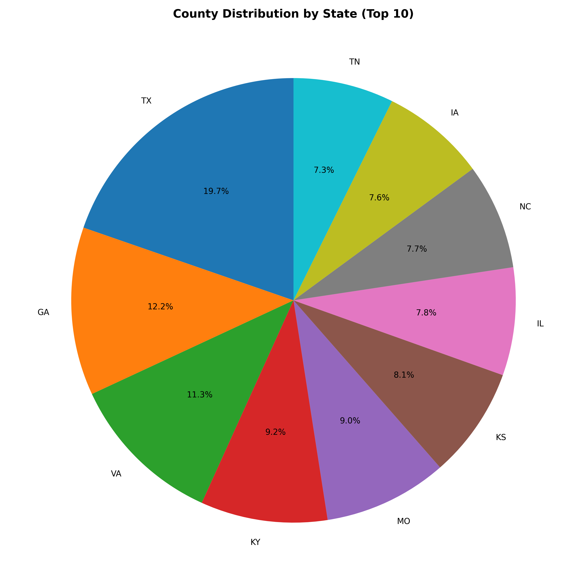
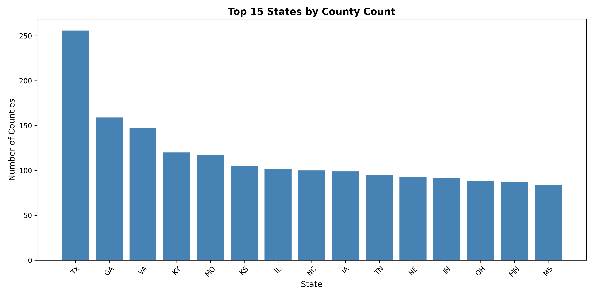
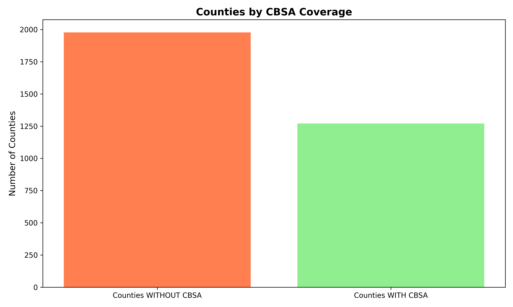

# 🏥 NPPES Healthcare Provider Analytics

<p align="center">
  
  
  
  
  
</p>

> **Production-grade ELT pipeline processing 8.85M healthcare provider records (9.9 GB) through a medallion architecture — orchestrated with Airflow, modeled in dbt, and served from Snowflake.**

---

## 📌 Project Overview

| | |
|---|---|
| **Dataset** | NPPES National Provider Identifier Registry (CMS) |
| **Scale** | 8,850,000+ records · 9.9 GB raw data |
| **Architecture** | Medallion (Bronze → Silver → Gold) |
| **Orchestration** | Apache Airflow |
| **Transformation** | dbt Core (staging → intermediate → marts) |
| **Warehouse** | Snowflake |
| **Storage** | AWS S3 (data lake) |
| **Processing** | Polars + DuckDB |
| **Code Quality** | Ruff (pycodestyle, isort, flake8-bugbear, security rules) |

---

## 🏗️ Architecture

```
┌─────────────────────┐
│   CMS Public Data   │
│   (NPPES CSVs)      │
└──────────┬──────────┘
           │ Extract
           ▼
┌─────────────────────┐
│     AWS S3          │
│   Bronze Layer      │  ← Raw data lake
└──────────┬──────────┘
           │ Polars + DuckDB cleaning
           ▼
┌─────────────────────┐
│     AWS S3          │
│   Silver Layer      │  ← Cleaned Parquet files
└──────────┬──────────┘
           │ dbt Load
           ▼
┌─────────────────────┐
│     Snowflake       │
│   Gold Layer        │  ← Analytics-ready marts
│                     │
│  staging/           │
│  ├─ stg_providers   │
│  ├─ stg_taxonomy    │
│  └─ stg_fips        │
│                     │
│  marts/             │
│  ├─ provider_summary│
│  ├─ by_state        │
│  ├─ by_county       │
│  ├─ directory       │
│  └─ specialty_dist  │
└──────────┬──────────┘
           │
           ▼
┌─────────────────────┐
│  Airflow DAGs       │  ← End-to-end orchestration
│  Analytics &        │
│  Visualizations     │
└─────────────────────┘
```

### Data Flow
1. **Extract** — Download raw NPPES data from CMS public registry
2. **Load** — Upload to AWS S3 Bronze layer (raw data lake)
3. **Clean** — Polars + DuckDB processing into Silver layer (Parquet)
4. **Transform** — dbt models build staging and mart layers in Snowflake
5. **Orchestrate** — Airflow DAGs manage end-to-end pipeline execution
6. **Analyze** — Query Gold layer for geographic and specialty insights

---

## 🔍 Business Questions Answered

| Question | Why It Matters |
|---|---|
| How many providers operate in each state? | Healthcare access and capacity planning |
| What are the most common specialties by geography? | Identifying underserved specialties by region |
| Individual providers vs. organizations — what's the split? | Market structure analysis |
| Which counties have the highest provider density? | Rural vs. urban healthcare access gaps |

---

## 📊 Key Insights

- **8.85M providers** across 54 states and territories, representing 842 unique specialties
- **78.3% individual providers** vs. 21.7% organizations nationally
- Significant **geographic concentration** — top 5 states account for ~40% of all providers
- Rural counties show dramatically lower provider-to-population ratios than urban CBSAs

---

## 🧮 dbt Data Models

### Staging Layer (1:1 with sources)
| Model | Description |
|---|---|
| `stg_nppes_providers` | Cleaned provider records with standardized column names |
| `stg_taxonomy` | Healthcare specialty classification codes (NUCC) |
| `stg_fips` | Geographic reference data (state/county FIPS codes) |

### Mart Layer (Business Logic)
| Model | Description |
|---|---|
| `mart_provider_summary` | Overall dataset statistics — total providers, entity types, coverage |
| `mart_providers_by_state` | Provider counts and metrics aggregated by state |
| `mart_providers_by_county` | County-level provider density analysis |
| `mart_provider_directory` | Searchable provider directory with specialty info |
| `mart_specialty_distribution` | Medical specialty analysis across regions |

---

## 📐 Sample Queries

```sql
-- Top 10 states by provider count
SELECT
    state,
    total_providers,
    individual_providers,
    organization_providers
FROM mart_providers_by_state
ORDER BY total_providers DESC
LIMIT 10;

-- Provider directory search by specialty
SELECT
    provider_name,
    provider_type,
    specialty_name,
    city,
    zip_code
FROM mart_provider_directory
WHERE state = 'CA'
  AND specialty_classification = 'Physician'
LIMIT 20;

-- Overall dataset summary
SELECT * FROM mart_provider_summary;
```

---

## 📈 Visualizations

### Geographic Distribution

*Top 10 states by provider count — California, Texas, and New York lead nationally.*

### County Analysis

*Provider distribution across the top 15 states by county coverage.*

### Metropolitan Coverage

*Counties within Core-Based Statistical Areas (metropolitan regions).*

---

## 📁 Repository Structure

```
NPPES/
├── data/
│   ├── raw/                        # Raw CSV files from NPPES
│   └── cleaned/                    # Cleaned Parquet files (Silver layer)
├── nnpes/                          # dbt project
│   ├── models/
│   │   ├── staging/                # 1:1 source transformations
│   │   └── marts/                  # Business-ready analytics tables
│   ├── dbt_project.yml
│   └── dev.duckdb
├── dags/                           # Airflow DAG definitions
├── scripts/
│   ├── clean_nppes.py              # Polars data cleaning
│   ├── upload_to_s3.py             # S3 upload automation
│   ├── visualize_data.py           # Chart generation
│   └── explore_raw_data.py         # Data exploration
├── src/
│   ├── s3_services.py              # AWS S3 utilities
│   └── my_logger.py                # Custom logging
├── visualizations/                 # Generated charts
├── query_examples.sql              # Sample SQL queries
├── ruff.toml                       # Code quality configuration
├── requirements.txt
└── README.md
```

---

## 🚀 Quick Start

### Prerequisites
- Python 3.9+
- AWS account (for S3 features)
- Snowflake account
- ~10GB free disk space

```bash
# Clone the repo
git clone https://github.com/JingYou-data/NPPES.git
cd NPPES

# Install dependencies
pip install -r requirements.txt

# Set up environment variables
cp .env.example .env
# Edit .env with your AWS + Snowflake credentials

# Run data cleaning
python scripts/clean_nppes.py

# Run dbt transformations
cd nnpes
dbt run
dbt test
```

---

## 🚀 Future Work

- [ ] **Incremental dbt models** — avoid reprocessing all 8.85M rows on each run
- [ ] **Streamlit dashboard** — interactive provider density maps by county
- [ ] **Geographic mapping** — Folium/Plotly choropleth showing provider access gaps
- [ ] **Great Expectations** — comprehensive data quality validation beyond dbt tests
- [ ] **Docker containerization** — reproducible local development environment

---

## 📦 Data Sources

| Source | URL |
|---|---|
| NPPES Registry | [CMS National Provider Identifier Registry](https://npiregistry.cms.hhs.gov/) |
| Taxonomy Codes | [NUCC Healthcare Provider Taxonomy](https://www.nucc.org/) |
| FIPS Codes | [US Census Bureau](https://www.census.gov/) |

---

## 👤 Author

**Jing You** — Data Analytics & Engineering
[](https://www.linkedin.com/in/jing-you84/)
[](https://github.com/JingYou-data)
[](https://jingyou-data.github.io)

---

*Production-grade ELT pipeline · NPPES CMS Public Data · Modern Data Stack*
